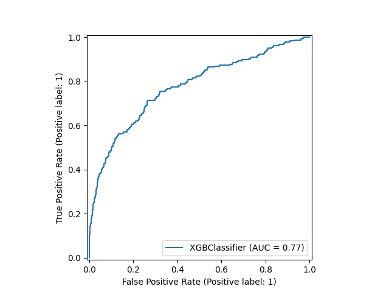
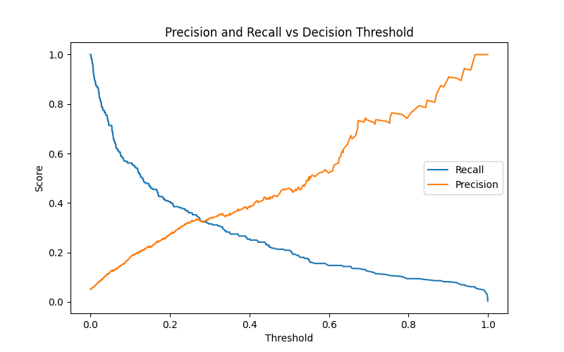

✨ Key Features
Real-Time Predictions: Classifies transactions instantly using a pre-trained XGBoost model.

Interactive UI: A user-friendly web interface built with HTML, CSS, and JavaScript.

High-Performance Model: The model is optimized for high recall (85%) to catch as many fraudulent cases as possible.

Detailed Analysis: Provides not just a decision, but also the fraud probability and the confidence level of the prediction.

Full-Stack Implementation: A complete system with a Flask backend serving the model via an API and a separate frontend for user interaction.

📈 Model Performance
The heart of this application is the XGBoost model, which was trained on a balanced dataset using the SMOTE technique. Its performance on the test set is summarized below.

Performance Curves

   

Classification Metrics
The key metrics for the fraud class were:

Precision: 0.73 (When it predicts fraud, it's correct 73% of the time)

Recall: 0.85 (It successfully identifies 85% of all actual fraud cases)

🛠️ Technology Stack
Backend: Python, Flask

Frontend: HTML, CSS, JavaScript

Machine Learning: Scikit-learn, XGBoost, Pandas, NumPy, imbalanced-learn

Deployment: The application is served via a local Flask server.

⚙️ Getting Started
To get a local copy up and running, follow these simple steps.

Prerequisites
You need to have Python (3.7+) and pip installed on your machine.

Installation
Clone the repository:

bash
git clone https://github.com/AbhijitPatill/Credit_card_fraud_detection.git
Navigate into the project directory:

bash
cd Credit_card_fraud_detection
Create and activate a virtual environment (recommended):

bash
# For Windows
python -m venv venv
.\venv\Scripts\activate

# For macOS/Linux
python3 -m venv venv
source venv/bin/activate
Install the required dependencies:

bash
pip install -r requirements.txt
Running the Application
Start the Flask server:

bash
python main.py
Open your web browser and navigate to the address shown in the terminal, which is typically:
http://127.0.0.1:5000
